# Distributed DER Management Systems

## Legacy SCADA and Data Historian Comparison

Legacy SCADA and data historian platforms were designed for vertically integrated utilities operating a limited number of centralized assets. These systems assume static compute topology, continuous connectivity, scalability constraints, and infrequent change. Modern DER portfolios invalidate those assumptions.

### Operational Differences

Legacy SCADA systems rely on centralized, stateful headends where real-time control, data collection, and operator interaction are tightly coupled. This creates large fault domains, brittle integrations, and high operational risk during failures or upgrades.

In contrast, a SaaS DER Management System:
- Distributes control logic across independent components
- Treats connectivity as intermittent, not guaranteed
- Isolates failures to individual assets, sites, or services
- Enables rolling upgrades without system-wide outages
- Decouples data ingestion, control, and visualization

Data historians in legacy environments further compound fragility by enforcing synchronous ingestion and rigid schemas, limiting scalability and adaptability.

### Economic Differences

Legacy platforms incur fixed costs regardless of utilization:
- Licensed headend capacity
- Dedicated hardware and storage
- Vendor-specific maintenance contracts
- Specialized operational skillsets

Costs scale poorly as DER counts, markets, and regulatory requirements increase. SaaS platforms replace these fixed costs with variable, usage-aligned operating expenses and commodity infrastructure, materially lowering financial risk.

---

## Maintaining Legacy SCADA for ICCP and ISO/RTO Integration

While legacy SCADA systems are increasingly unsuitable for fleet-wide DER management, they often remain necessary for **ICCP-based integration with ISO/RTO control centers**.

Most ISO/RTOs require:
- ICCP/TASE.2 connectivity
- Strict change control and certification
- Stable, long-lived endpoints
- Proven operational behavior under grid events

As a result, many organizations retain a **minimal, tightly scoped SCADA footprint** specifically to satisfy ISO/RTO interface requirements.

### Recommended Boundary

In this architecture:
- Legacy SCADA is retained **only** as an ICCP and RTU gateways
- It is not used for DER-level control, optimization, or analytics
- It interfaces with the SaaS DER platform via controlled, auditable data exchanges

This sharply reduces:
- Operational complexity
- Security exposure
- Upgrade risk
- Vendor lock-in

### Strategic Outcome

SCADA becomes a **compliance interface**, focused on reliability requirements not the operational core.  
The SaaS DER platform assumes responsibility for:
- Fleet orchestration
- Market optimization
- Asset lifecycle management
- Data analytics and reporting

This approach preserves ISO/RTO compatibility while avoiding continued investment in an architecture that does not scale.

---

## Cost and TCO Model

### Legacy Cost Drivers

Legacy DER and SCADA environments accumulate cost through:
- Hardware procurement and refresh cycles
- Capacity overprovisioning for peak conditions
- Manual upgrade and validation windows
- Custom integrations for each market or asset type
- Vendor lock-in and long-term support contracts

These costs grow superlinearly with portfolio size and operational complexity.

### SaaS Cost Characteristics

A SaaS DER Management System exhibits fundamentally different cost behavior:
- No dedicated headend hardware
- Elastic infrastructure scaling
- Automated deployment and rollback
- Standardized APIs and integration patterns
- Reduced dependency on specialized vendor expertise

Operating expenses scale predictably with asset count and activity rather than installed capacity.

### 5–10 Year TCO Outcome

Over a 5–10 year horizon, SaaS-based DER management consistently delivers:
- Lower capital expenditure
- Predictable operating costs
- Reduced outage and incident recovery costs
- Faster deployment of new programs and revenue streams
- Elimination of periodic “system replacement” events

The most significant advantage is avoidance of architectural rewrites as portfolios grow or market participation evolves.

---

## Managing Cybersecurity Risk and NERC CIP Compliance

Cybersecurity and regulatory compliance are primary design constraints for any DER platform operating in or adjacent to Bulk Electric System (BES) environments.

This architecture is designed to **reduce CIP scope, simplify compliance, and limit cyber risk exposure**.

### Scope Reduction by Design

Key principles used to manage CIP exposure:
- No inbound connectivity required to DER sites
- Cloud services operate outside BES Cyber System definitions
- Edge agents enforce least-privilege communication
- Legacy SCADA remains the sole ICCP/RTU BES interface

By design, the SaaS platform minimizes the number of assets that could be classified as BES Cyber Assets or BES Cyber Systems.

### Security Architecture Characteristics

- Strong identity-based authentication and authorization
- Explicit separation of control, data, and visualization planes
- Comprehensive audit logging and immutable event histories
- Cryptographic protection for data in transit and at rest
- Deterministic software deployment and version control

### Operational Compliance Benefits

Compared to monolithic SCADA environments, this architecture:
- Reduces the number of systems subject to CIP controls
- Simplifies access management and logging
- Limits lateral movement during cyber incidents
- Supports faster patching without coordinated outages
- Enables clearer demarcation between IT and OT responsibilities

The result is **lower compliance burden**, reduced audit complexity, and improved security posture without sacrificing operational capability.

## Assumptions and Non-Goals

### Assumptions

- ISO/RTO participation requires ICCP/TASE.2 connectivity via legacy or certified systems
- DER field assets do not exercise direct BES control authority
- Cloud-hosted services operate in enterprise IT environments, not BES control centers
- Network connectivity to DER sites may be intermittent or degraded

### Non-Goals

- Replacing ISO/RTO-certified ICCP implementations
- Acting as a registered Balancing Authority, TO, or GOP system of record
- Direct real-time protection or relay control of BES assets
- Expanding BES Cyber System scope beyond existing SCADA boundaries

This system is explicitly designed to **complement**, not disrupt, existing regulatory and operational frameworks.

## Architectural Principles

### Core Principles

The system is designed under the assumption that failure, latency, and partial connectivity are normal operating conditions.

**Fault Domain Isolation**  
Each DER, site, tenant, and service operates as an independent fault domain. Failures are contained and non-cascading.

**Stateless Cloud Control Plane**  
The cloud layer maintains intent and desired state but does not require continuous real-time connectivity to assets.

**Edge Autonomy**  
Local control agents enforce safety, constraints, and fallback behavior independently of cloud availability.

**Event-Driven Operation**  
All telemetry, control, and state transitions are asynchronous, tolerant of retries, delays, and reordering.

**Horizontal Scalability**  
System capacity increases by adding instances, not by upgrading centralized components.

---

## High-Level System Architecture

### Edge Control Layer

- Lightweight DER control agents
- Local safety, interlocks, and constraints
- Protocol abstraction for heterogeneous assets
- Secure outbound communication

### Cloud Control Plane

- Stateless orchestration services
- Policy evaluation and dispatch intent
- Fleet-level optimization and coordination
- Authentication, authorization, and audit

### Data and Event Layer

- Telemetry ingestion pipelines
- Event buses for commands and state changes
- Time-series and operational data stores
- Decoupled producers and consumers

### Integration and Access Layer

- ISO/RTO and market interfaces
- Utility and aggregator APIs
- Operator dashboards
- Enterprise integrations (EMS, billing, reporting)

### Control Flow

1. Market or program signals enter the control plane  
2. Dispatch intent is computed and published as events  
3. Edge agents receive and acknowledge commands asynchronously  
4. Agents execute locally and report outcomes independently  

No synchronous, global coordination is required for safe operation.

---

## Current Simulator Cut (what’s running now)

- **Headend HTTP API**: `/assets`, `/telemetry/{id}`, `/telemetry/{id}/history` (returns empty array if no DB), `/dispatch` (JSON ack), `/agents` (lists connected agents with asset/site/peer). Optional Postgres stores telemetry and agent sessions.
- **Headend gRPC (agent-initiated only)**: `AgentLink::Stream` (bidirectional). Agents connect out, send Register + Telemetry; headend pushes Setpoint. No inbound listeners required on agents.
- **Agent sessions persisted**: `agent_sessions` table records asset_id, asset/site names, peer, connected_at/disconnected_at.
- **Edge agent**: Ticks locally, sends telemetry every 4s, applies setpoints from the gRPC stream, reconnects with backoff if the headend is down.
- **Launcher**: `agent_launcher` reads `assets.yaml` (override `ASSETS_PATH`), and spawns one `edge_agent` per asset. Point agents at the headend with `HEADEND_GRPC` (e.g., `127.0.0.1:50070`).
- **Config scaling**: `assets.yaml` can be expanded to large fleets (e.g., 100 assets). Headend tick loop still runs unless disabled; for agent-only telemetry, guard or remove the local tick loop.

---

## Executive Bottom Line

This architecture enables organizations to:
- Retain legacy SCADA only where contractually or regulatorily required
- Reduce cybersecurity risk and CIP compliance scope
- Lower long-term operational and capital costs
- Scale DER portfolios without architectural rewrites
- Improve reliability under real-world operating conditions

The result is a DER Management System built for durability, robustness, scalability, and cost control over the next decade.

---

## Appendix A: NERC CIP Compliance Mapping (CIP-002 through CIP-013)
### Compliance Determination Disclaimer

Final BES Cyber System classification and CIP applicability determinations are the responsibility of the Registered Entity and its Compliance organization. This appendix describes **architectural intent and design characteristics** intended to support reduced CIP scope, but does not supersede formal compliance assessments, registrations, or regulatory interpretations.

This appendix provides a high-level mapping of the proposed SaaS DER Management System architecture to NERC CIP standards CIP-002 through CIP-013.

The architecture is intentionally designed to:
- Minimize the number of assets in CIP scope
- Avoid classification of DER field assets as Medium Impact BES Cyber Systems
- Constrain CIP applicability primarily to legacy SCADA components retained for ICCP and RTU integration

### Architectural Scope Assumptions

- **Cloud data centers hosting the SaaS control plane are architected to remain outside BES Cyber System classification due to lack of BES control authority, ICCP or RTU participation, or routable ESP connectivity**
- **On-site DERs and edge agents are not Medium Impact BES Cyber Assets **
- **Legacy SCADA systems used for ICCP and RTU communications remain the primary BES Cyber Systems**
- **ICCP links, RTU front ends, and DMZs define the BES boundary**

- Cloud data centers are not BES Cyber Assets in this design not because they are cloud, but because:
    - They do not perform BES control functions
    - They do not terminate BES protocols
    - They do not connect into ESPs
    - They do not replace or augment ICCP systems
    - Legacy SCADA remains the BES boundary.
    - Everything else is intentionally outside it.

This aligns with common ISO/RTO and utility interpretations.

---

### CIP-002: BES Cyber System Categorization

- Legacy SCADA systems supporting ICCP and RTU front-ends are categorized per existing utility processes
- Cloud-hosted DER Management services are architected outside BES Cyber System definitions
- DER field devices remain non-BES Cyber Assets due to:
  - Limited functionality
  - Lack of real-time BES control authority
  - Absence of routable inbound connectivity

**Outcome:**  
CIP scope is limited and well-defined.
BES Cyber System classification decisions remain subject to entity registration status, functional role, and compliance interpretation.

---

### CIP-003: Security Management Controls

- Policies and procedures apply primarily to legacy SCADA environments
- SaaS platform security controls are governed by enterprise IT security frameworks
- Clear demarcation between OT (SCADA) and IT/cloud environments

**Outcome:**  
Reduced procedural overhead and audit scope.

---

### CIP-004: Personnel and Training

- CIP-qualified personnel are required only for:
  - SCADA administration
  - ICCP configuration and operations
- Cloud platform operations follow standard corporate access controls and training

**Outcome:**  
Smaller pool of CIP-trained personnel required.

---

### CIP-005: Electronic Security Perimeters (ESP)

- ESPs are defined around legacy SCADA, RTU Front-Ends, and ICCP endpoints
- No inbound connectivity to DER sites
- No direct network paths from cloud services into ESPs

**Outcome:**  
Simplified perimeter definitions and enforcement.
Cloud-hosted services do not terminate within Electronic Security Perimeters and do not establish inbound routable connectivity to ESP-protected systems.

---

### CIP-006: Physical Security of BES Cyber Systems

- Applies only to SCADA infrastructure
- No physical security controls required for cloud infrastructure under CIP
- DER sites remain outside Medium Impact physical security scope

**Outcome:**  
Physical security scope remains unchanged or reduced.

---

### CIP-007: System Security Management

- Patch management and vulnerability handling focused on:
  - SCADA and related servers
  - ICCP interfaces
- Cloud services leverage:
  - Immutable infrastructure
  - Rapid patch deployment
  - Isolated networking compute zones
  - Automated vulnerability remediation

**Outcome:**  
Improved security posture with lower operational burden.

---

### CIP-008: Incident Reporting and Response

- Incident response plans centered on:
  - SCADA and ICCP environments
- Cloud platform incidents handled under enterprise IR processes
- Clear escalation boundaries defined between IT and OT incidents

**Outcome:**  
Cleaner incident classification and response.

---

### CIP-009: Recovery Plans for BES Cyber Systems

- Recovery plans maintained for legacy SCADA
- SaaS platform recovery handled via:
  - Redundant cloud zones or regions
  - Stateless services
  - Automated redeployment

**Outcome:**  
Faster recovery with fewer CIP artifacts.

---

### CIP-010: Configuration Change Management

- Formal change control required for:
  - ICCP endpoints
  - SCADA configurations
- SaaS platform supports:
  - Versioned deployments
  - Full audit trails
  - Deterministic rollbacks

**Outcome:**  
Reduced risk during compliance-sensitive changes.

---

### CIP-011: Information Protection

- BES Cyber System information confined to SCADA environments
- Cloud data encrypted at rest and in transit
- Access governed by role-based controls and logging

**Outcome:**  
Clear data ownership and protection boundaries.

---

### CIP-013: Supply Chain Risk Management

- Vendor risk management applies primarily to:
  - SCADA vendors
  - ICCP software providers
- SaaS platform enables:
  - Transparent dependency management
  - Faster vendor risk mitigation
  - Reduced reliance on proprietary OT vendors

**Outcome:**  
Lower long-term supply chain risk.

---

### CIP Summary

This architecture:
- Minimizes Medium Impact CIP scope
- Preserves required ICCP and RTU Front-end integrations
- Reduces audit surface area
- Improves cybersecurity posture without increasing compliance burden

---

## Appendix B: Executive Architecture Diagram

**Note:** Legacy SCADA is retained exclusively to meet ISO/RTO ICCP requirements. All DER-level control, optimization, and analytics functions are performed outside the BES Cyber System boundary.

## Appendix C: CIP-005 Electronic Security Perimeter (ESP) – Outbound-Only Connectivity

The following diagram illustrates how Electronic Security Perimeters (ESPs) are preserved by ensuring
that **no inbound routable connectivity exists from cloud services or edge devices into BES Cyber Systems**.
All communications crossing the ESP boundary are **initiated outbound** from OT systems.

