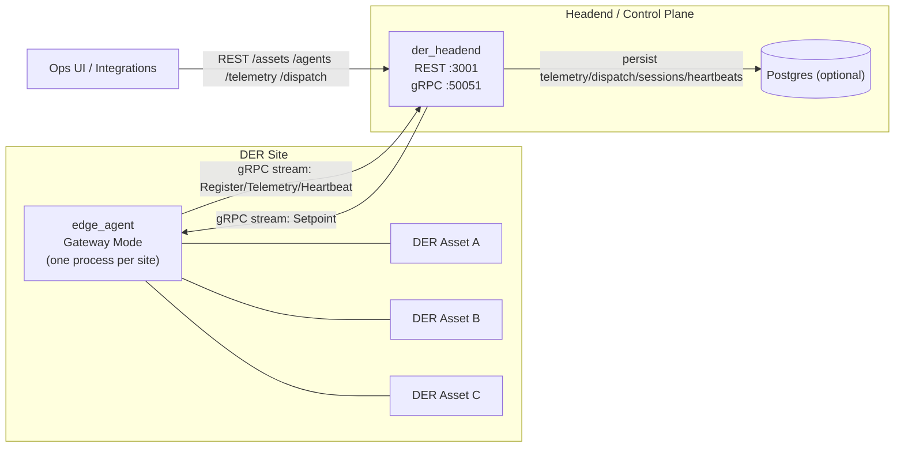

# Current Architecture (as implemented)

This document reflects the **current working MVP** as of Dec 2025, including **Edge Gateway Mode**, improved `/agents` output, and DB reset support.

## Overview
This MVP is a **Distributed Energy Resource (DER) telemetry + dispatch control plane** designed for easy scaling from single assets to **site-level gateways**.

It is intentionally split into a lightweight **headend** (control plane) and one or more **edge agents** (field plane) so you can:
- deploy with **outbound-only** edge connectivity (no inbound firewall rules required at DER sites),
- onboard assets/sites without inbound firewall rules to customer networks,
- keep field connectivity simple and resilient (agents reconnect),
- evolve toward DERMS / VPP-style group control while keeping the MVP small.

## Use cases

### MVP (what this implementation demonstrates)
- **DER telemetry ingestion:** collect periodic telemetry from multiple assets and expose “latest known” values via API.
- **Operator dispatch (BESS charge/discharge):** send a signed MW setpoint to a single asset (point control) or to a site (aggregate control).
  - Convention (MVP): **positive MW = discharge/export**, **negative MW = charge/import** (clamped to each asset’s `min_mw`/`max_mw`).
- **Edge Gateway Mode:** represent multiple assets at a site with one agent process and one outbound gRPC stream.
- **Ops visibility:** list assets and show connection status + recent sessions.

### Near-term product use cases (next logical steps)
- **Fleet onboarding:** add new sites/assets via config + provisioning workflow; validate connectivity.
- **Basic DERMS controls:** group/site dispatch policies, guardrails, ramp-limiting, and simple constraint enforcement.
- **VPP aggregation (foundational):** build toward portfolio control and higher-level optimization (future).

## Purpose
- Provide a clean, testable reference implementation for **DER telemetry ingestion** and **dispatch/setpoint delivery**.
- Demonstrate **Edge Gateway Mode**: one agent per site representing multiple assets.
- Serve as the baseline architecture for future productization (authn/z, multi-tenancy, fleet management, auditing).

## Requirements

### Functional
- Load an asset inventory from YAML and expose it via `GET /assets`.
- Accept dispatch commands over REST and deliver them over gRPC to the correct connected agent.
- Support **simple BESS charge/discharge control** via signed MW setpoints (positive=discharge, negative=charge) with per-asset clamping.
- Provide stable operator-facing interfaces:
  - REST: `/assets`, `/agents`, `/telemetry/:asset_id`, `/dispatch`
  - gRPC: bidirectional stream for Register/Telemetry/Heartbeat (agent→headend) and Setpoint (headend→agent)
- Support two dispatch targets:
  - **Per-asset:** `{ "asset_id": "…", "mw": N }`
  - **Per-site:** `{ "site_id": "…", "mw": N }` (Gateway Mode)
- In Gateway Mode, split per-site dispatch deterministically (capacity-weighted) and clamp to per-asset limits.
- Expose connection/session visibility via `GET /agents` (one row per configured asset).

### Non-functional
- **Outbound-only** from the field: edge agents initiate and maintain the gRPC connection.
- Deterministic, debuggable behavior (stable ordering, explicit logging for splits and registration).
- Clear routing semantics (per-asset commands must not accidentally fan out; `asset_id` wins over `site_id`).
- Optional persistence (runs without a DB; can use Postgres when `DATABASE_URL` is set).
- Developer ergonomics: quick reset of state (`RESET_DB`) and repeatable local demo flow.

## Non-goals (current MVP)
- Market integrations (ISO/RTO, DMS/SCADA), bidding/optimization, or scheduling.
- Multi-tenant authn/z, RBAC, audit trails, and customer provisioning.
- Real device protocol integration (Modbus/OPC UA/ICCP) beyond simulated telemetry.

## System components
- **der_headend**: central service
  - REST API (default `127.0.0.1:3001`)
    - Key endpoints: `/assets`, `/agents`, `/telemetry/:asset_id`, `/dispatch`
  - gRPC server (default `127.0.0.1:50051`, override with `HEADEND_GRPC_ADDR`)
  - Optional Postgres persistence (`DATABASE_URL`)
  - Dev convenience: `RESET_DB` (truthy) truncates DB tables on startup **when `DATABASE_URL` is set**

- **edge_agent**: outbound-initiated edge connectivity
  - Initiates a bidirectional gRPC stream to headend (`HEADEND_GRPC`)
  - Sends `Register / Telemetry / Heartbeat`; receives `Setpoint`
  - Supports two modes:
    - **Single-asset mode:** one agent process represents one `asset_id` (legacy env var config)
    - **Gateway Mode:** one agent process represents **all assets for one `site_id`**
      - loads assets from YAML (`ASSETS_PATH`)
      - enabled via `GATEWAY_SITE_ID` (optional `GATEWAY_ID`, defaults to the site id)

- **agent_launcher**: test harness (not production)
  - Reads an assets YAML and spawns one `edge_agent` per asset
  - Useful to validate behavior quickly and simulate many assets

- **sim_core**: shared types + tick logic (used by agent)

## Addressing and routing
- **Registration** (implemented)
  - `edge_agent` sends one `Register` containing a primary `asset_id` (legacy compatibility) and an `assets[]` list.
  - `der_headend` registers each `assets[i].asset_id` as served by the same underlying gRPC stream.

- **Dispatch** (implemented)
  - Per-asset: `POST /dispatch { "asset_id": "…", "mw": N }` routes to exactly one asset.
  - Per-site: `POST /dispatch { "site_id": "…", "mw": N }` routes to the gateway agent (site-level command).
  - For BESS-style assets in the MVP, MW is signed: **positive=discharge**, **negative=charge** (subject to min/max clamps).

- **Target precedence rule (important)**
  - If a `Setpoint` includes both `asset_id` and `site_id`, the agent treats it as **per-asset** (asset_id wins) to avoid accidental fanout.

## Data flows and interfaces
- Telemetry:
  - `edge_agent` → (gRPC stream) → `der_headend` → (optional DB + in-memory latest)
  - Source of telemetry:
    - If OPC UA nodes are configured and `telemetry_write_sim=false`, the agent **reads telemetry from OPC UA**.
    - Otherwise the agent **simulates telemetry** and may write it to OPC UA when `telemetry_write_sim=true`.
- Dispatch:
  - client → (REST `/dispatch`) → `der_headend` → (gRPC `Setpoint`) → `edge_agent`
  - In Gateway Mode, `site_id` dispatch triggers a split policy inside `edge_agent`.
- Presence / sessions:
  - `edge_agent` → Heartbeat / Register → `der_headend`
  - `GET /agents` returns **one row per configured asset** and includes `asset_id`, `asset_name`, `site_id`, `site_name`, `peer`, `connected`, and recent sessions.

## edge_agent simulation model (testing)

The MVP uses `edge_agent` as a **simulated DER controller/telemetry source** so the end-to-end control path can be tested without real devices.

### What the simulation does today
- Loads an asset inventory (either from env vars in single-asset mode or from YAML in Gateway Mode).
- Establishes an outbound gRPC stream to the headend.
- Periodically emits a minimal telemetry payload (sufficient to verify:
  - per-asset telemetry identity,
  - setpoint application,
  - last-seen timestamps / liveness).
- Accepts `Setpoint` commands and updates the simulated asset state.

### Simple BESS simulator behavior (current MVP)
- The agent simulates BESS behavior for demo/testing: register → heartbeat/telemetry tick → accept setpoints.
- Setpoints are signed MW: **+MW = discharge/export**, **-MW = charge/import**, clamped to `min_mw`/`max_mw`.
- Single-asset mode: one simulated BESS per process.
- Gateway Mode: one process represents multiple BESS assets at a `site_id`.
  - Per-site dispatch triggers capacity-weighted split + clamping.
  - Per-asset dispatch updates only the targeted asset (`asset_id` wins over `site_id`).

### How to run it for tests
- **Single-asset mode:** start one `edge_agent` per asset (often via `agent_launcher`).
- **Gateway Mode:** start one `edge_agent` per site using `GATEWAY_SITE_ID` + `ASSETS_PATH`.
  - Expected: multiple assets show the same `peer` on `GET /agents`.

### What to validate
- Registration: `GET /agents` shows one row per configured asset and `connected:true` for served assets.
- Telemetry: `GET /telemetry/:asset_id` returns distinct updates per asset and a current timestamp.
- Dispatch routing:
  - Per-asset dispatch changes only the targeted asset.
  - Per-site dispatch triggers the split policy inside the agent (capacity-weighted + clamped).

### What this simulation is (and is not)
- It is a **harness** to prove routing, addressing, and control/telemetry plumbing.
- It is not yet a device protocol adapter (Modbus/OPC UA/ICCP) and does not model complex plant physics.

## Telemetry model and expanding to multiple DER types

The MVP currently focuses on a **minimal BESS/storage-shaped telemetry set** so Gateway Mode + dispatch routing can be validated quickly. As the product evolves toward DERMS/VPP use cases, telemetry should become:
- **type-aware** (PV vs Wind vs EV charging vs Storage),
- **extensible** (new fields without breaking older agents/headends), and
- **normalized enough** for fleet views (a common set of "always present" metrics).

### Recommended approach
1. Keep a **small common core** telemetry schema that applies to all DERs.
2. Add a DER **asset_type** and allow **type-specific extensions**.
3. Preserve backward compatibility (headend must tolerate missing optional fields).

### Suggested common core telemetry (all DERs)
- Identity: `asset_id`, `site_id`, `timestamp`
- Power:
  - `mw` (signed; generation positive, consumption negative)
  - `mw_setpoint` (last commanded value; optional)
- Availability / health:
  - `online` (bool)
  - `status` / `fault_code` (optional string/code)

### Type-specific telemetry extensions (examples)

**Storage / BESS**
- `soc_pct`, `soh_pct`
- `energy_mwh` (or `usable_energy_mwh`)
- `dc_voltage`, `dc_current` (optional)
- `inverter_temp_c` / `ambient_temp_c` (optional)

**PV**
- `ac_mw` (same as `mw`, but keep if you want explicit AC vs DC)
- `irradiance_wm2` (optional)
- `module_temp_c` (optional)
- `inverter_state` / `curtailment_reason` (optional)

**Wind**
- `wind_speed_ms` (optional)
- `turbine_rpm` (optional)
- `yaw_deg` / `pitch_deg` (optional)
- `availability_pct` / `turbine_state` (optional)

**EV charging / Car charging**
- `station_state` (available/charging/fault)
- `active_sessions` (int)
- `load_mw` (same as `mw` but usually negative consumption)
- `energy_delivered_mwh` (rolling window or lifetime; optional)

### Where this shows up in the architecture
- gRPC (`Telemetry`) should carry the **core fields** plus optional type-specific fields.
- REST `/telemetry/:asset_id` can return a normalized JSON view:
  - a top-level core payload, and
  - a `details` object for type-specific fields.

### MVP guidance
- Don’t explode the schema in v1: pick 6–10 fields per asset type.
- Add fields only when there is a concrete operator workflow (dashboard, alerts, or a control guardrail) that needs them.

## Architecture diagram

