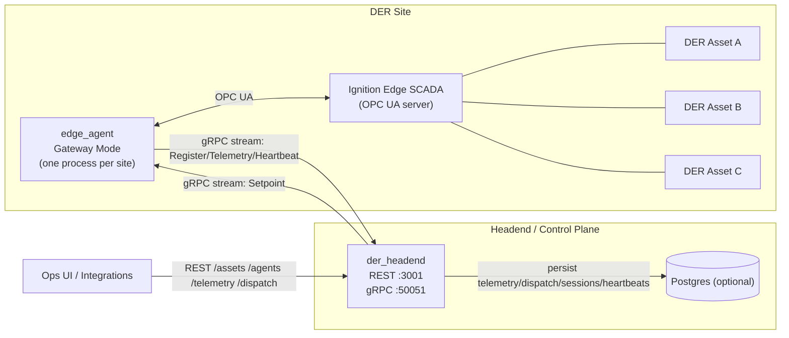

# Product Cutsheet — Distributed DER Telemetry + Control Plane

## One-liner
A modern, cloud-ready control plane for distributed energy resources (DERs) built as an **API-first, streaming, gateway-enabled** platform for telemetry, dispatch, and fleet operations — designed for secure deployment and resilient operation across many sites, with a clear path from a **managed pilot service** to **multi-tenant SaaS**.

## What it is
This product is a **DER telemetry + dispatch platform** (DERMS foundation) built for fleets of storage, PV, wind, EV charging, and mixed DER sites.

It is deliberately designed as a **real-time operational platform** rather than a passive data sink:
- treats telemetry as a **real-time data product** (not a byproduct),
- supports **outbound-only** site connectivity via edge agents (simplifies security for cloud deployment), and
- enables **site and fleet control workflows** (not just time-series storage).

## Why a modern control-plane architecture
DER fleets are operational systems: they need reliable telemetry, clear control semantics, and predictable behavior under intermittent connectivity.

Traditional patterns often start with “get all the data into a SCADA headend, central store” and then build control and integrations around it. That can work, but it frequently struggles when you need:
- **Secure-by-default connectivity:** customer sites should not need inbound firewall holes.
- **Elastic scale:** thousands of assets across many sites, with heterogeneous protocols.
- **Operational durability:** telemetry and commands must behave sensibly during outages and reconnects.

This platform is built as a control plane first (telemetry + dispatch + visibility). If long-term archiving is required, the system can export to a historian or data lake — but operations aren’t coupled to it.

## Headend SCADA vs Edge Gateway (simple comparison)

**Headend SCADA + utility protocols to every site** does work, but it tends to become expensive and brittle at scale
- **Networking/security friction:** inbound access to site networks (VPNs, pinholes, NAT, static IPs) and long approval cycles.
- **Protocol sprawl in the core:** the headend and/or site RTUs becomes a museum of adapters (DNP3/IEC/Modbus/etc.) with site-specific quirks.
- **Operational fragility:** troubleshooting is dominated by legacy SCADA calculations, tunnels, ports, and “why is this one site different?”
- **Slow change cadence:** upgrades and point mapping changes ripple through a centralized system.

**Edge Gateway + modern headend (this platform)** shifts complexity to the edge and keeps the core clean:
- **Outbound-only security posture:** the edge initiates connections (easier customer security approvals; smaller attack surface).
- **Normalization at the edge:** site protocols terminate locally; the headend supports one consistent API and gRPC data streams.
- **Gateway-native fleet operations:** per-site control and multi-asset routing are first-class.
- **Faster onboarding + iteration:** add sites with configuration + adapters; evolve without rewriting the der_headend core.

**Practical reality:** many customers keep a local SCADA/HMI (e.g., Ignition). This platform complements it by exposing/consuming familiar interfaces at the site (OPC UA/Modbus/etc.) while enabling fleet-level operations from the headend. For pilots, run **one Ignition Edge gateway per agent/site** and connect the `edge_agent` to its OPC UA server (e.g. Ignition SCADA).
**No SCADA-to-SCADA:** the headend is an API-first control plane; the site SCADA remains local and does not peer with a master SCADA.

## Durability and resilience (site + headend)

Reliable fleet operations require the system to behave well when links flap, sites go offline, or downstream services (like databases) are unavailable.

**At the site (edge):**
- Outbound-only network-initated connectivity with automatic reconnect.
- A clear place to implement *store-and-forward* (buffer telemetry locally during short outages) and apply local guardrails.
- Site gateways reduce network and protocol complexity by aggregating multiple assets behind one durable connection.
- Not necessary to have two diseparate connections - one for Data Historian, one for control and telemetry.

**At the headend (control plane):**
- Backpressure and bounded queues to prevent overload.
- Durable ingest patterns (e.g., internal event queue) so transient DB issues don’t drop the system.
- Explicit delivery semantics (best-effort vs at-least-once) with observable state.

**Why it matters:** durability reduces “data gaps,” prevents surprise behavior.

## Durability promises (MVP vs V1)

To keep expectations crisp, here is what is **true today** vs what is **planned for a pilot-ready V1**.

### MVP (Now)
- **Connectivity:** outbound-only agent stream with automatic reconnect.
- **Visibility:** `/agents` shows connection status and recent sessions (helps diagnose flapping/reconnects).
- **Telemetry:** best-effort streaming; “latest known” API for each asset.
- **Dispatch:** best-effort delivery over the gRPC live stream to edge_agent; clear routing semantics (per-asset vs per-site).
- **Storage:** optional der_headend persistence when Postgres is enabled (dev-friendly reset supported).

**Not yet guaranteed in MVP:** durable buffering at the edge, a durable ingest queue in the headend, replay/backfill, or end-to-end delivery guarantees beyond “best effort.”

### V1 (Pilot-ready)
- **Headend durability:** bounded queues + backpressure; ingestion decoupled from storage so transient DB issues don’t break the system.
- **Edge durability:** store-and-forward option for short outages (configurable buffer + drop policy).
- **Dispatch lifecycle:** acknowledgements + state machine (submitted/sent/acked/expired) and observable outcomes.
- **Explicit semantics:** documented guarantees (e.g., at-least-once telemetry ingest; dispatch delivery/ack behavior).

## What you get (business outcomes)
- **Lower integration and maintenance cost:** fewer bespoke point-to-point connections and fewer "PI glue scripts."
- **Faster onboarding:** bring on a new site via a gateway agent and configuration-driven mapping.
- **Higher operator confidence:** clear routing semantics, deterministic behavior, and first-class visibility into connections and sessions.
- **Future-proof foundation:** evolve toward DERMS/VPP needs (portfolio aggregation, constraints, workflows) without rewriting the core.

## Core capabilities (today’s MVP)
- **Outbound agent connectivity (gRPC):** edge agents initiate and maintain a bidirectional stream to the headend.
- **Connection/session visibility:** per-asset connection state and recent sessions via `/agents` (useful for diagnosing reconnects).
- **Edge Gateway Mode:** one agent per site can represent multiple assets (multi-asset registration over one stream).
- **Integration with Ignition SCADA OPC UA Server** - controls from der_headend and asset telemetry
- **Telemetry ingestion + “current state" and historical API:** query per-asset telemetry by ID.
- **Dispatch via REST → gRPC:**
  - per-asset dispatch (`asset_id`) via RESTful API
  - per-site dispatch (`site_id`) with deterministic split policy (capacity-weighted, clamped). Sites consist of one or more (`assets`) via RESTful API 
- **Operational visibility:**
  - `/assets`, `/telemetry` and `/agents` API endpoints
  - `/agents` includes `site_id`, `site_name`, connection status, peer, and recent sessions
- **Developer ergonomics:** optional DB persistence.

## Differentiators
- **API-first control plane:** RESTful API for operator/integration workflows + gRPC for efficient streaming.
- **Outbound-only edge network security posture:** simplifies customer network approval and reduces attack surface.
- **Gateway-native:** site controller semantics are built-in, not bolted on.
- **Deterministic routing:** per-asset commands do not accidentally fan out (asset targeting wins over site context).
- **Path to real adapters:** Integration of OPC UA (e.g `Ignition SCADA`) architecture supports protocol adapters (OPC UA, Modbus, MQTT, DNP3) feeding a normalized telemetry model.

## Architecture snapshot (simple)
- **Headend:** REST + gRPC services, optional Postgres. Any type of customized UI is possible using - `HTML`
- **Edge agent:** outbound gRPC stream, runs as single-asset agent or site gateway.
- **Adapters (V1+):** protocol connectors on the edge (OPC UA / Modbus TCP / MQTT / DNP3) normalize device points into a consistent telemetry model.

## Architecture diagram

## Edge integration examples (Ignition OPC UA interoperability)

Many sites already standardize on a local SCADA/HMI stack (e.g., **Ignition**) and prefer **OPC UA** as the on-site interoperability layer. A practical V1 pattern is to run **one Ignition Edge gateway per agent** and have the `edge_agent` act as an **OPC UA client** against that server.

### Example A — Ignition Edge hosts the OPC UA server
- **Ignition Edge (OPC UA server)** hosts the site tags and security model.
- The `edge_agent` (OPC UA client) reads telemetry tags and writes control tags:
  - `Assets/<asset_id>/Telemetry/...` (read-only)
  - `Assets/<asset_id>/Controls/SetpointMW` (writable)
  - `Assets/<asset_id>/Status/Online`, `LastSeen`, `FaultCode` (read-only)
- A write to `Controls/SetpointMW` triggers the same dispatch path the platform uses (optionally with local validation/limits).

**Why this matters:** Site SCADA teams can integrate the platform without learning a new protocol and can build local screens/alarms almost immediately.

### Example B — Gateway Mode + site-level OPC UA surface
- A single Gateway `edge_agent` serves multiple assets at a site.
- Ignition can expose both:
  - per-asset points (`Assets/<asset_id>/...`)
  - a site aggregate (`Site/Controls/SiteDispatchMW`) that maps to a `site_id` dispatch.
- The gateway applies the site split policy (e.g., capacity-weighted) and exposes the computed allocations back into OPC UA (e.g., `Site/Allocations/<asset_id>/MW`).

**Why this matters:** the site can keep existing SCADA workflows while gaining a clean path to fleet-level control.

> Note: Ignition Edge OPC UA integration (one per agent/site) is a **V1 pilot feature** (adapter/interface), not a fully shipped capability of the MVP.

## Data export and coexistence (historian optional)
Many organizations keep a historian or data platform for long-term archiving and analytics. This product focuses on **operating the fleet** (telemetry + dispatch + visibility) and can export telemetry to external systems when needed.

The key idea: operations should not depend on a brittle chain of tag mappings and bespoke scripts. The control plane remains the system of record for operational state, while historians/data lakes remain destinations for retention and analysis.

## Target users
- DER operators and aggregators
- Storage + renewables owners
- Utilities running non-wires or flexible load programs
- Trading/optimization teams that need reliable telemetry + controllable assets

## Delivery model (trajectory)

### Today: managed pilot service (cloud-hosted, typically single-tenant)
- A hosted control plane operated by the vendor as a managed service, with outbound-only edge connectivity.
- Single-tenant per customer is common at this stage (simpler security boundaries and faster onboarding).
- Goal: prove reliability, dispatch semantics, and operator workflows with real assets.

### Next: pilot-ready V1 service
- Security baseline (mTLS + API auth), durability improvements (bounded queues + store-and-forward option), and a thin operator UI.
- Clear operational runbooks, monitoring, and upgrade story.

### Later: multi-tenant SaaS
- Tenant isolation, RBAC, audit trails, quotas/billing hooks, and compliance-ready controls.
- Optional regional deployment and data residency options as needed.

## V1 (pilot-ready) roadmap highlights
- **Security baseline:** mTLS for gRPC + basic REST auth.
- **Durable semantics:** backpressure + bounded queues; clear retry semantics; dispatch lifecycle + acks; groundwork for store-and-forward at the edge.
- **Telemetry model v1:** common core + type-specific extensions (Storage/PV/Wind/EV).
- **Protocol adapters:** 1–2 pilot-grade interfaces (typically OPC UA + Modbus TCP).
- **SCADA interoperability:** optional `edge_agent` **OPC UA server** surface for Ignition/HMI integration (read telemetry + write setpoints)
- **Operator UI v1:** assets/agents/telemetry/dispatch console with guardrails and split preview.
- **SaaS foundations (V2 path):** tenant model + RBAC + audit trails + quotas (not required for first pilots, but designed-in)

## What this is not (yet)
- A full optimization engine, market bidding system, or “AI dispatch.”
- A promise of “supports every protocol.”
- A replacement for every plant historian use case.
- A fully multi-tenant SaaS offering today (positioned as a managed pilot service first)

## Call to action
If you’re operating DERs and tired of historian-centric glue code, this platform is built to become your **modern DERMS foundation**.

**Next conversation starters:**
- What protocols are at your sites today (OPC UA, Modbus, MQTT, DNP3)?
- Do you dispatch per-asset, per-site, or by portfolio?
- What’s your current “system of record” for operations — and where does it hurt?
